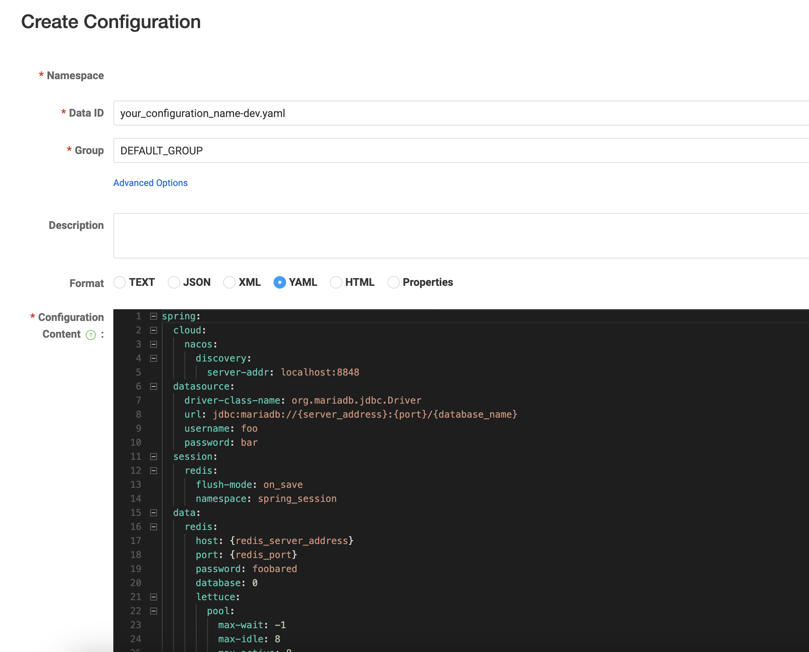

# NX-AUTO-ALI

A simple example using spring cloud alibaba

## Updates

1. Upgrade SpringBoot version to 3.1.1
2. Add Spring Security to protect APIs.
3. Add Spring Session.
4. Integrated with MyBatis-Plus.
5. Use Nacos central configuration.

## Project Structure

app-gateway: gateway service

app-common: core entities, models, repositories/mappers, spring security filters

ms-*: micro services

## How To Run

1. Set up a MariaDB server and import the dev.sql file, set up a Redis server.
2. Download Nacos Server from <https://nacos.io>, unzip and run a standalone instance with following command:  

    Linux and macOS:

    ```bash
    $NACOS_HOME/bin/startup.sh -m standalone 
    ```

    Windows:

    ```bash
    %NACOS_HOME%/bin/startup.cmd -m standalone 
    ```

3. Access [http://localhost:8848/nacos/#/configurationManagement](http://localhost:8848/nacos/#/configurationManagement), create a YAML format configuration as following picture says.
    
    Configuration example can be found in res directory.
4. Build app-common
5. Run ms-auth, ms-customer and ms-shop, at port 8090, 8081 and 8082
6. Run app-gateway, at port 8080
7. Access [http://localhost:8848/nacos/index.html#/serviceManagement](http://localhost:8848/nacos/index.html#/serviceManagement) to check if the services are registered in Nacos
8. Open a terminal window, access login API to get X-Auth-Token:

    ```bash
      curl --request POST 'http://localhost:8080/api/v1/auth/login' \
          -d "username=jacob&password=000000"
    ```

   it will return a json response like this:

    ```json
    {
        "msg": "OK",
        "data": {
            "userId": 1,
            "email": "jacob@example.com",
            "token": "4be4d210-1f78-4b8e-b88d-bd1304a2246c",
            "username": "jacob"
        },
        "status": 200
    }
    ```

9. Then access other APIs with X-Auth-Token in request header, for example:

    ```bash
    curl -X GET 'http://localhost:8080/api/v1/customer/1'\
         -H 'X-Auth-Token:4be4d210-1f78-4b8e-b88d-bd1304a2246c'
    ```

    you will get correct response, like this:

    ```json
    {
        "msg": "OK",
        "data": {
            "id": 1,
            "addTime": "2020-02-17T09:54:07.000+00:00",
            "updateTime": "2022-08-28T16:57:03.000+00:00",
            "status": 1,
            "customerName": "Jacob Zyrael",
            "address": "Somewhere",
            "city": "Austin"
        },
        "status": 200
    }
    ```
